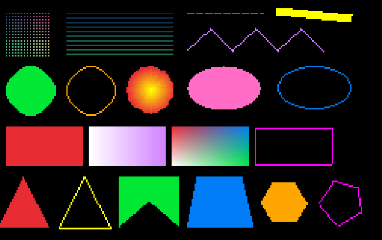
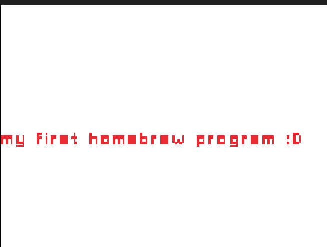

# Raylib-DS

  
Graphics programming for the ds has never gotten easier!  
Raylib-DS is a port of raylib to the nintendo ds, taking advantage of modern libraries along with the DS's 3d engine!  
It currently is in a very early state but there will be ongoing updates!  

## Example 
Here is all the code you need to get something showing on the ds!
```
#include "rcore_ds.h"
#include "rtext_ds.h"

int main(void){
    InitWindow(256,192,"my first program!");
    while(!WindowShouldClose())
    {
        BeginDrawing();
        ClearBackground(WHITE);
        DrawText(0,100"my first homebrew program :D",RED);
        EndDrawing();
    }
    return 0;

}
```



## Compatibility
Currently I am trying to get as much of raylib to work as possible, but some things the ds just can't do, so here is a list of everything that has been added and stuff that may be added in the future!

### Already added
* File handling, input and other initialisation/drawing/misc functions in rcore
* Lines,triangles,rectangles,circles,elipses and polygons as well as their special versions in rshapes
* Texture loading and animated textures. Compatible with both ppm and png files
* Audio loading (16 channels for .wav files, 1 channel per song including stereo audio for now) and ability to play 1 .wv file as a background track
* rtext for text drawing on the top screen
* Better image manipulation
* Camera2D!!!
### Planned compatibility
* All of the shapes in rshapes
* More freedom for the user to use other libraries on the bottom screen

### Unlikely compatibility
* Rendertextures
* all 3d stuff
* rmodels
* vr stuff and mouse


## How to install

You would need to install [Blocksds](https://blocksds.skylyrac.net/docs/setup/)

if you dont have these aliases then add them using 
``` 
export BLOCKSDS=/opt/wonderful/thirdparty/blocksds/core
export BLOCKSDSEXT=/opt/wonderful/thirdparty/blocksds/external 
```
since the makefiles rely on it

Then just open up your projects' directory, use the template makefile in the repo, and type make `make`!
>Note that the makefile is currently unfinished, but compiling with it still works

# License
This project is licensed under the zlib/libpng license


# Documentation  
I will add documentation as the library progresses, since there are some DS specific functions that people can find useful. They are found in [DOCS.md](DOCS.md)